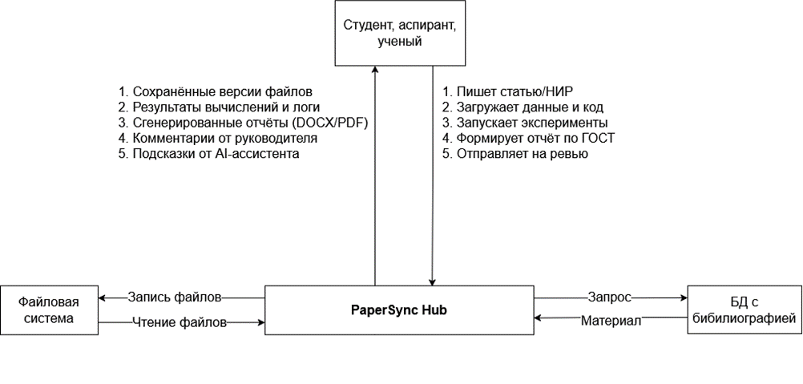
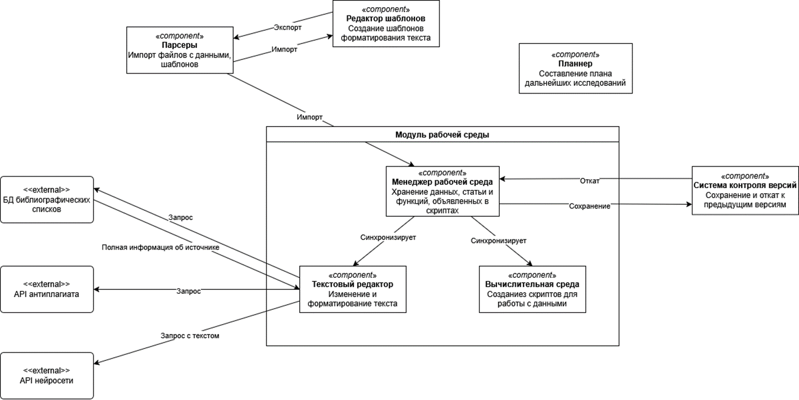
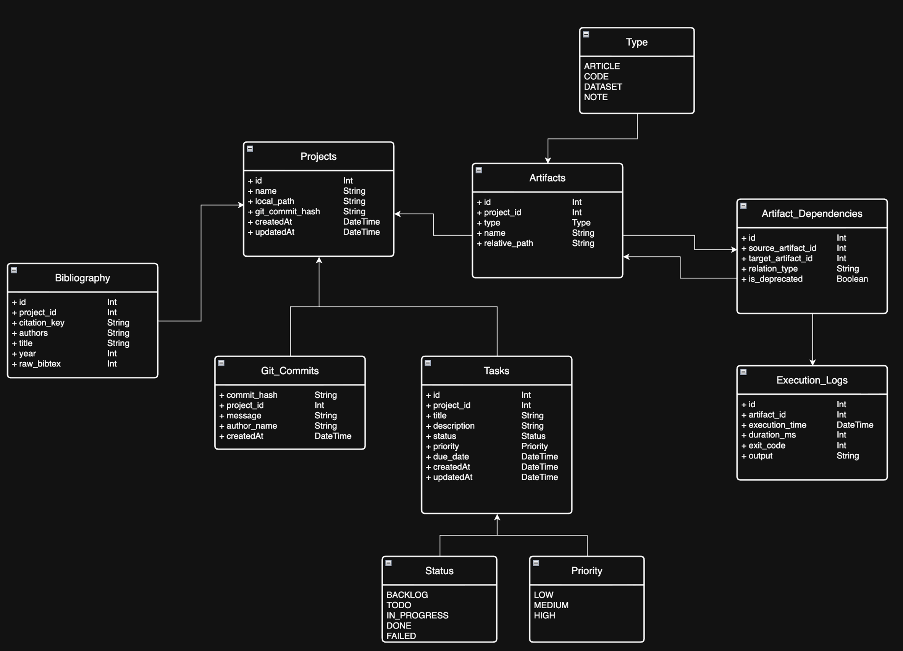

# ОргСтатья
Локальный хаб для науки, который объединяет статьи, код, данные и заметки. Встроенный IDE, контроль версий, управление библиографией и экспорт полного проекта в один клик. C# + AvaloniaUI.

## Итерации
- [Итерация 3](Итерации/Итерация_3.md)
- [Итерация 4](Итерации/Итерация_4.md)
- [Итерация 5-6](Итерации/Итерация_5_6.md)

## Состав команды
- Куличков Олег [@HubOl01](https://github.com/HubOl01)
- Пашанов Иван [@kargadesh](https://github.com/kargadesh)
- Шестернев Даниил [@DaniilS103](https://github.com/DaniilS103)

## Идея проекта
Современный научный workflow фрагментирован: исследователи вынуждены хранить статьи, код используемых скриптов, датасеты, черновики, библиографию и логи экспериментов в разных приложениях. Это приводит к потере контекста, несовпадению версий файлов и невозможности воспроизвести результаты через месяцы или годы.  

**ОргСтатья** решает эту проблему, создавая локальное, кроссплатформенное десктоп-приложение (C# + AvaloniaUI), которое связывает все артефакты научной работы в единое пространство. Проект гарантирует сквозную воспроизводимость экспериментов, обеспечивает быструю вставку библиографических ссылок, оптимизирует хранение данных и предоставляет однокнопочный экспорт полного комплекта материалов для сдачи или архивирования.

---

## Границы проекта

| Входит в область | Не входит в область (на текущем этапе) |
|------------------|----------------------------------------|
| Локальное хранение данных (`local-first`, данные не покидают ПК без явного экспорта) | Облачная синхронизация между устройствами или командный доступ в реальном времени |
| Кроссплатформенный десктоп-клиент (Windows, Linux, macOS) | Замена полноценных IDE (VS Code, PyCharm, RStudio, MATLAB) |
| Интеграция системы контроля версий с визуализацией изменений (git) | Платформа для рецензирования, публичного шеринга или краудсорсинга |
| Встроенная вычислительная среда (Jupyter/MATLAB-подобная) с поддержкой `.md`, `LaTeX` и математических расчётов | Прямая загрузка платных статей или обход paywall-систем |
| Управление библиографией, тезисами и веб-ссылками | Полноценный CI/CD для продакшн-кода |
| Однокнопочный экспорт архива, содержащего текст научной статьи и данных экспериментов | |

---

## Цели и задачи

**Главная цель**  
Создать надёжное локальное рабочее пространство, которое помогает избегать разрозненности в версиях данных и текста, минимизирует административные затраты и упрощает подготовку научных материалов от черновика до сдачи.

**Задачи проекта**
1. **Унификация артефактов** - разработать архитектуру связывания `Статья ↔ Код ↔ Данные ↔ Заметки ↔ Библиография` с автоматическим отслеживанием зависимостей.
2. **Версионирование** - интегрировать систему контроля версий с наглядной историей изменений, ветвлением и возможностью отката.
3. **Вычислительное окружение** - интегрировать ноутбук-подобную среду с поддержкой `Markdown`, `LaTeX`, математических формул и выполнения кода (Python/Julia/R через ядра).
4. **Управление библиографией** — организовать ведение единого списка литературы, автоматическое форматирование ссылок по выбранному стилю и их мгновенную вставку в текст статьи.
5. **Бесшовный экспорт** - обеспечить однокнопочную сборку всего проекта в структурированный архив (с метаданными, логами, версиями) для сдачи или архивирования.

## Бизнес-требования

**Цели продукта**

| Идентификатор | Цель | Критерий достижения (метрика) | Приоритет |
|--------------|------|------------------------------|-----------|
| BR-01 | Сокращение времени на вставку ссылок на использованную литературу | Вставка ссылки на источник требует всего 2 клика | Средний |
| BR-02 | Обеспечение оптимизированного хранения данных | Размер файлов, создаваемых программой, не превышает размер файлов в форматах конкурентов более чем на 20%  | Высокий |
| BR-03 | Снижение потерь контекста при переключении между артефактами | Пользователь выполняет 80% рабочих операций в рамках одного интерфейса | Средний |
| BR-04 | Минимизация ошибок версионирования | Автоматическое отслеживание зависимостей между файлами в 95% случаев | Высокий |
| BR-05 | Обеспечение приватности данных (local-first) | Все пользовательские данные по умолчанию хранятся локально, экспорт — только по явному запросу | Высокий |
| BR-06         | Упрощение передачи результатов научной работы                     | Экспорт полного комплекта файлов (статья + код + данные + логи) выполняется одной кнопкой за 1 минуту   | Высокий   |

**Ограничения бизнеса**
- Бюджет разработки: ограниченный (студенческий проект)
- Сроки: подготовка концепции и ТЗ в рамках текущего семестра
- Ресурсы: команда из 3 человек, частичная занятость
- Лицензирование: использование open-source компонентов там, где это возможно

---

## Заинтересованные лица и их требования

**Список стейкхолдеров**
| Стейкхолдер           | Роль                     | Потребности                                                                                              | Связанные бизнес-требования       |
| --------------------- | ------------------------ | -------------------------------------------------------------------------------------------------------- | --------------------------------- |
| Студент-исследователь | Основной пользователь    | Быстро вставлять ссылки на литературу, не терять версии, экспортировать полный комплект работы для сдачи | BR-01, BR-03, BR-04, BR-05, BR-06 |
| Научный руководитель  | Рецензент, заказчик      | Получать структурированный архив с текстом, кодом и результатами для проверки воспроизводимости          | BR-04, BR-06                      |
| Лаборатория/кафедра   | Организационный заказчик | Архивирование проектов, стандартизация структуры работ, экономия дискового пространства                  | BR-02, BR-04, BR-05               |
| Разработчик системы   | Техническая команда      | Чёткая архитектура, модульность, возможность расширения функционала                                      | Все, особенно BR-03               |


**Пользовательские истории**

```
Как студент-исследователь,
Я хочу вставить ссылку на источник в текст статьи за 2 клика,
Чтобы не тратить время на ручной поиск и форматирование библиографии.

Как студент-исследователь,
Я хочу связать черновик статьи с исходным кодом эксперимента и датасетом,
Чтобы при изменении кода система подсказывала, какие разделы статьи требуют обновления.

Как студент-исследователь,
Я хочу экспортировать весь проект одним архивом, включая текст статьи, код, данные и логи,
Чтобы сдать работу преподавателю без ручной сборки файлов и риска что-то упустить.

Как научный руководитель,
Я хочу получить от студента структурированный архив проекта с версионированным кодом и результатами,
Чтобы проверить работу и при необходимости воспроизвести эксперимент без дополнительных запросов.

Как разработчик ОргСтатья,
Я хочу реализовать модульную архитектуру с чёткими интерфейсами для работы с файлами и версиями,
Чтобы упростить поддержку и дальнейшее развитие системы.
```

---

## Функциональные требования, атрибуты качества, ограничения

**Функциональные требования**

| Идентификатор | Требование                | Описание                                                                                                          |
| ------------- | ------------------------- | ----------------------------------------------------------------------------------------------------------------- |
| FR-01         | Управление артефактами    | Система позволяет создавать, связывать и редактировать сущности: Статья, Код, Датасет, Заметка, Библиография      |
| FR-02         | Встроенный редактор       | Поддержка Markdown, LaTeX, математических формул, подсветка синтаксиса для основных языков                        |
| FR-03         | Вычислительное ядро       | Запуск кода (Python/Julia/R) в изолированном окружении с сохранением результатов и логов                          |
| FR-04         | Контроль версий           | Интеграция с Git: коммиты, ветки, история изменений, визуализация диффов                                          |
| FR-05         | Экспорт проекта           | Однокнопочная сборка архива с метаданными, версиями, отчётами и логами |
| FR-06         | Управление библиографией  | Импорт/экспорт в BibTeX, RIS; вставка ссылок в текст за 2 клика; автоматическое форматирование                    |
| FR-07         | Отслеживание зависимостей | Автоматическая фиксация связей между артефактами (код -> результаты -> раздел статьи)                             |
| FR-08         | Оптимизация хранения      | Сжатие и дедупликация данных внутри проекта для минимизации занимаемого места                                     |

**Атрибуты качества**

| Категория | Требование | Обоснование |
|-----------|------------|-------------|
| Производительность | Запуск приложения ≤ 3 сек, отклик интерфейса ≤ 200 мс | Для сохранения потока работы исследователя |
| Надёжность | Автосохранение каждые 30 сек, восстановление после сбоев | Предотвращение потери данных при длительной работе |
| Безопасность | Все данные локальны, шифрование экспортируемых архивов по запросу | Соответствие требованиям вузов и приватности |
| Удобство использования | Интерфейс осваивается за ≤ 15 минут, справка встроена | Целевая аудитория — не обязательно технически подготовленные пользователи |
| Расширяемость | Модульная архитектура, плагины для новых языков/форматов | Возможность развития без переписывания ядра |
| Совместимость | Поддержка Windows 10/11, Linux (Ubuntu 20.04+), macOS 12+ | Кроссплатформенность как ключевое требование |

## Общий системный контекст


Системный контекст определяет границы проектируемого решения, его пользователей и внешние сущности.

## Пользователи системы
**Студент, аспирант, ученый** — основной субъект системы:
   * Пишет статьи и отчеты о научно-исследовательских работах.
   * Загружает экспериментальные данные и исходный программный код.
   * Запускает вычислительные эксперименты.
   * Формирует итоговые отчеты в соответствии с требованиями ГОСТ.
   * Отправляет готовые материалы на ревью.

### Окружение системы:
* **ОргСтатья** — центральное ядро системы, координирующее все внутренние процессы.
* **Файловая система** — внешнее хранилище для долговременной фиксации сохраненных версий файлов, результатов вычислений, логов, а также сгенерированных отчетов в форматах DOCX/PDF.
* **БД с библиографией** — внешняя база данных для отправки запросов и получения структурированных материалов и метаданных публикаций.
---

## Интерфейс взаимодействия и пропускная способность
Для понимания нагрузки на каналы связи и пропускной способности спроектированы параметры интерфейсов обмена данными. Все ключевые операции переведены на асинхронный способ обмена, что предотвращает блокировку интерфейса при обработке тяжелых файлов.

| Формат | Предполагаемое количество запросов в час | Способ обмена | Объём |
| :--- | :---: | :--- | :--- |
| **md** | 1 | Асинхронный | Неограниченно |
| **csv** | 1 | Асинхронный | Неограниченно |
| **xls** | 1 | Асинхронный | Неограниченно |
| **xlsx** | 1 | Асинхронный | Неограниченно |
| **json** | 1 | Асинхронный | Неограниченно |
| **py** | 1 | Асинхронный | Неограниченно |

---

## Внутренняя структура системы и компонентная модель
Внутренняя логика системы декомпозирована на изолированные слабосвязанные компоненты, взаимодействующие друг с другом для обеспечения непрерывного цикла разработки НИР.



**Функциональное распределение по компонентам**
* **Модуль рабочей среды** — основной контейнер, объединяющий пользовательские инструменты работы над проектом.
  * **Менеджер рабочей среды:** Отвечает за оперативное хранение данных сессии, текущей статьи и функций, объявленных в скриптах. Осуществляет взаимную синхронизацию текстового и вычислительного редакторов.
  * **Текстовый редактор:** Интерфейс изменения и форматирования текста. Взаимодействует с внешними API (`БД библиографических списков`, `API антиплагиата`, `API нейросети` для подсказок).
  * **Вычислительная среда:** Изолированный модуль создания и выполнения скриптов (например, `.py` ) для работы с экспериментальными данными.
* **Система контроля версий:** Компонент, реализующий операции сохранения текущих состояний и отката к предыдущим версиям артефактов при необходимости.
* **Парсеры:** Компонент импорта файлов с данными и готовых шаблонов документов.
* **Редактор шаблонов:** Инструмент создания шаблонов автоматического форматирования текста под требования регламентов.
* **Планнер:** Компонент составления плана и ведения графика дальнейших исследований.

---

## Схема базы данных



### Ключевые сущности:
* **Projects:** Хранит базовую информацию о проекте НИР (`id`, `name`, `local_path`, `git_commit_hash`, временные метки).
* **Artifacts:** Рабочие файлы проекта (Статьи, Код, Датасеты, Заметки), типизированные через перечисление `Type`.
* **Artifact_Dependencies:** Таблица связей, отслеживающая зависимости между артефактами (какой код сгенерировал конкретный датасет или какая статья его использует) и флаг актуальности `is_outdated`.
* **Tasks:** Инструмент планирования. Задачи привязаны к проектам и конкретным артефактам, имеют приоритеты (`LOW`, `MEDIUM`, `HIGH`) и статусы (`BACKLOG`, `TODO`, `IN_PROGRESS`, `DONE`, `FAILED`).
* **Execution_Logs:** Логи выполнения вычислительных скриптов, хранящие время запуска, длительность (`duration_ms`), код завершения (`exit_code`) и текстовый консольный вывод (`output_log`).
* **Bibliography:** Список используемой литературы и цитирований, привязанный к проекту, включая поддержку сырого формата `raw_bibtex`.
* **Git_Commits:** Лог фиксаций изменений в системе контроля версий.

---

## Спецификация SQL-запросов базовых сценариев

### Инициализация проекта и добавление артефактов 
```sql
-- Создание проекта
INSERT INTO Projects (name, local_path, git_commit_hash, createdAt, updatedAt) 
VALUES ('ОргСтатья - Диплом', '/projects/orgstatya', 'a1b2c3d4', NOW(), NOW());

-- Добавление артефакта статьи
INSERT INTO Artifacts (project_id, type, name, relative_path, status) 
VALUES (1, 'ARTICLE', 'Черновик статьи', '/articles/draft.docx', 'ACTIVE');

-- Добавление исходного кода
INSERT INTO Artifacts (project_id, type, name, relative_path, status) 
VALUES (1, 'CODE', 'Скрипт анализа данных', '/code/analyze.py', 'ACTIVE');

-- Добавление набора данных
INSERT INTO Artifacts (project_id, type, name, relative_path, status) 
VALUES (1, 'DATASET', 'Результаты эксперимента', '/data/results.csv', 'READY');

-- Добавление рабочей заметки
INSERT INTO Artifacts (project_id, type, name, relative_path, status) 
VALUES (1, 'NOTE', 'Идеи для введения', '/notes/intro.txt', 'ACTIVE');

-- Создание задачи
INSERT INTO Tasks (project_id, artifact_id, title, description, status, priority, due_date, createdAt, updatedAt) VALUES (1, 1, 'Написать введение', 'Добавить описание цели проекта', 'TODO', 'HIGH', '2026-06-01 18:00:00', NOW(), NOW());

-- Еще одна задача
INSERT INTO Tasks (project_id, artifact_id, title, description, status, priority, due_date, createdAt, updatedAt) VALUES (1, 2, 'Проверить код', 'Проверить работу скрипта анализа', 'IN_PROGRESS', 'MEDIUM', '2026-06-03 20:00:00', NOW(), NOW());

-- Задачи вместе с названием проекта
SELECT Tasks.title, Tasks.status, Projects.name FROM Tasks JOIN Projects ON Tasks.project_id = Projects.id;

-- Артефакты проекта
SELECT Artifacts.name, Artifacts.type, Projects.name FROM Artifacts JOIN Projects ON Artifacts.project_id = Projects.id;

-- Добавление библиографии
INSERT INTO Bibliography (project_id, citation_key, authors, title, year, raw_bibtex) VALUES (1, 'ivanov2025', 'Иванов И.И.', 'Автоматизация научных статей', 2025, '@article{ivanov2025,...}');

-- Еще один источник
INSERT INTO Bibliography (project_id, citation_key, authors, title, year, raw_bibtex) VALUES (1, 'petrov2024', 'Петров А.А.', 'Работа с экспериментальными данными', 2024, '@article{petrov2024,...}');

-- Создание лога выполнения задачи
INSERT INTO Execution_Logs (artifact_id, task_id, execution_time, duration_ms, exit_code, output_log) VALUES (2, 2, NOW(), 2450, 0, 'Скрипт успешно выполнен');

-- Чтение логов выполнения задач
SELECT Tasks.title, Execution_Logs.duration_ms, Execution_Logs.output_log FROM Execution_Logs JOIN Tasks ON Execution_Logs.task_id = Tasks.id;
```
## Модель предметной области
Система работает со следующими сущностями:

* **Проект** — корневая сущность, объединяет все остальные элементы. Содержит название, путь к папке на диске, дату создания и обновления.
* **Артефакт** — любой значимый файл проекта: статья, код, датасет или заметка. Хранит название, тип, путь к файлу и описание. Тип определяет поведение системы — статьи открываются во встроенном редакторе.
* **Задача** — конкретное действие в рамках проекта. Имеет название, описание, приоритет (низкий, средний, высокий), статус (новая, в процессе, выполнена) и дедлайн.
* **Библиографическая запись** — источник, используемый в проекте. Хранит авторов, название, год и полный текст в формате BibTeX.
Версия — снимок состояния проекта в конкретный момент. Имеет уникальный хэш-идентификатор, описание изменений, автора и дату создания.
* **Зависимость между артефактами** — связь между двумя артефактами с указанием типа и актуальности. Позволяет строить граф взаимосвязей материалов.
* **Журнал выполнения** — история запусков артефакта с результатом, длительностью и выводом. Актуален для файлов типа "Код".
* **Связи** — один проект содержит много артефактов, задач, записей и версий. При удалении проекта всё связанное удаляется. Удалить артефакт, на который ссылаются другие, нельзя — это защищает целостность зависимостей.

## Ключевые сценарии использования
### Сценарий 1 — Успешное оформление проекта и добавление артефактов

**Действующие лица**

Исследователь, Приложение, База данных, Файловая система.

**Шаги**

1. Исследователь нажимает кнопку создания проекта на главном экране.
Система создаёт проект с названием по умолчанию и переходит на его страницу.
2. Исследователь нажимает кнопку добавления файла — открывается диалог выбора.
3. После выбора файлов система создаёт артефакт для каждого и отображает их в списке.

**Используемые данные**

Проект (название, дата создания), Артефакт (название, тип, путь к файлу, принадлежность проекту).

**Затронутые компоненты**

Главный экран, страница проекта, репозитории проектов и артефактов, база данных.

---
### Сценарий 2 — Редактирование артефакта

**Действующие лица**

Исследователь, Приложение, Файловая система.

**Шаги**

1. Исследователь кликает на артефакт в левой панели.
2. Система проверяет тип — для статьи открывает встроенный текстовый редактор.
3. Редактор считывает содержимое файла с диска и отображает его.
Исследователь редактирует текст и сохраняет — изменения записываются в файл.

**Используемые данные**

Артефакт (тип, путь к файлу).

**Затронутые компоненты**

страница проекта, текстовый редактор, файловая система.

---
### Сценарий 3 — Создание версии проекта
**Действующие лица**

Исследователь, Приложение, База данных.

**Шаги**

1. Исследователь нажимает "Синхронизировать изменения" — открывается окно истории.
2. Нажимает "Новая версия" и вводит описание изменений.
3. Система собирает данные всех артефактов, формирует снимок и вычисляет хэш.
4. Версия сохраняется в базе данных и появляется в списке истории.

**Используемые данные**

Артефакт (название, тип, путь, описание), Версия (хэш, описание, автор, дата).

**Затронутые компоненты**

Окно истории, сервис версионирования, репозиторий версий, база данных.

---
### Сценарий 4 — Управление задачами
**Действующие лица**

Исследователь, Приложение, База данных.

**Шаги**:
1. Исследователь нажимает иконку задач — открывается менеджер задач.
2. Система загружает задачи и делит их на активные и завершённые.
3. Исследователь создаёт задачу, заполняя название, приоритет и дедлайн.
4. Статус задачи меняется кликом прямо в списке: новая → в процессе → выполнена.

**Используемые данные**

Задача (название, описание, статус, приоритет, дедлайн, даты).

**Затронутые компоненты**

Cтраница задач, репозиторий задач, база данных.

## Сценарии с ошибками
### Ошибка 1 — Файл артефакта перемещён или удалён с диска
**Условие**

Исследователь добавил файл, после чего переместил или удалил его через проводник.


**Реакция системы**

При открытии артефакта система проверяет наличие файла. Если файл не найден, выводится сообщение об ошибке, предлагается восстановить файл

**Затронутые данные**

Поле пути в сущности Артефакт.

---

### Ошибка 2 — Попытка удалить артефакт с зависимостями

**Условие** 

Исследователь удаляет артефакт, на который ссылаются другие через зависимости.

**Реакция системы**

База данных отклоняет удаление из-за ограничения целостности. Операция завершается ошибкой.

**Затронутые данные**

Сущность Зависимость между артефактами. Требуется показывать пользователю понятное сообщение с перечнем зависимостей.

---
### Ошибка 3 — Сохранение пустого названия проекта или задачи
**Условие**

Исследователь очищает поле названия и пытается сохранить.

**Реакция системы**

Система проверяет заполненность поля. При пустом значении сохранение не происходит — для проекта сохраняется старое название, для задачи форма остаётся открытой.

**Затронутые данные**

Поле названия в сущностях Проект и Задача. Валидация срабатывает до обращения к базе данных.

## Сценарии развития системы
### Сценарий развития 1 — Реальный откат к предыдущей версии
**Текущее состояние** 

Версии создаются и хранятся, но кнопка отката не выполняет реального восстановления.

**Предлагаемое развитие**

Сохранять при версионировании не только метаданные, но и содержимое файлов. При откате — восстанавливать файлы на диске до состояния выбранной версии.

**Изменения в модели**

Добавить сущность "Снимок артефакта", связывающую версию с содержимым файла на тот момент.

---

### Сценарий развития 2 — ИИ-помощник в редакторе
**Текущее состояние** 

Кнопка ИИ в панели редактора есть, но не подключена к функциональности.

**Предлагаемое развитие**

Подключить языковую модель — исследователь выделяет текст, нажимает кнопку, получает предложение по улучшению или дополнению прямо в редакторе.

**Изменения в модели** 

Добавить сущность "Журнал взаимодействий с ИИ" с полями запроса, ответа и связи с артефактом.

---

### Сценарий развития 3 — Визуализация графа зависимостей
**Текущее состояние** 

Сущность зависимостей реализована и хранится в базе, но визуального представления нет.

**Предлагаемое развитие** 

Добавить экран с интерактивным графом — узлы это артефакты, рёбра — зависимости с типом связи. Модель данных уже готова, требуется только экран.

---

### Сценарий развития 4 — Применение шаблонов к проекту
**Текущее состояние**

Экран шаблонов с каталогом форматов (ГОСТ, APA, IEEE) реализован, но кнопка "Применить" ничего не делает.

**Предлагаемое развитие**

При применении шаблона автоматически создавать набор артефактов с предопределёнными разделами — "Введение", "Методология", "Результаты", "Заключение" и так далее.

**Изменения в модели**

Добавить поле "использованный шаблон" в сущность Проект.

## Сквозная трассировка требований
Бизнес-цель единого рабочего пространства реализуется через управление проектами и артефактами — исследователь работает со всем в одном приложении.

Бизнес-цель воспроизводимости реализуется через версионирование — система фиксирует состояние проекта в любой момент.
Бизнес-цель управления дедлайнами реализуется через систему задач с приоритетами и статусами.

Бизнес-цель структурирования материалов реализуется через шаблоны статей.

Потребности исследователя в организации файлов, редактировании текстов, отслеживании изменений и управлении работой покрываются четырьмя описанными сценариями использования.

**Атрибуты качества и их архитектурное воплощение**
* Надёжность достигается ограничениями целостности базы данных и системой миграций схемы
* Производительность — асинхронной работой с базой, не блокирующей интерфейс
* Расширяемость — паттерном "репозиторий", изолирующим доступ к данным
* Безопасность — локальным хранением без сетевой передачи
* Удобство использования — динамическим переключением рабочих панелей без перезагрузки интерфейса.

**Трассировка данных**

Сущность Проект создаётся на главном экране, используется на странице проекта. Артефакт создаётся при добавлении файлов, используется в редакторе и при создании версий. Задача создаётся и изменяется в менеджере задач, поля статуса и приоритета управляют сортировкой и цветовой индикацией. Версия создаётся сервисом версионирования и является иммутабельной. Библиографические записи и зависимости между артефактами имеют готовую инфраструктуру хранения, пользовательский интерфейс запланирован в следующих итерациях.


## Прототип

### Главный экран


### Редактор текста для разных форматов


### История изменений


### Список шаблонов для статей


### Планирование задач
